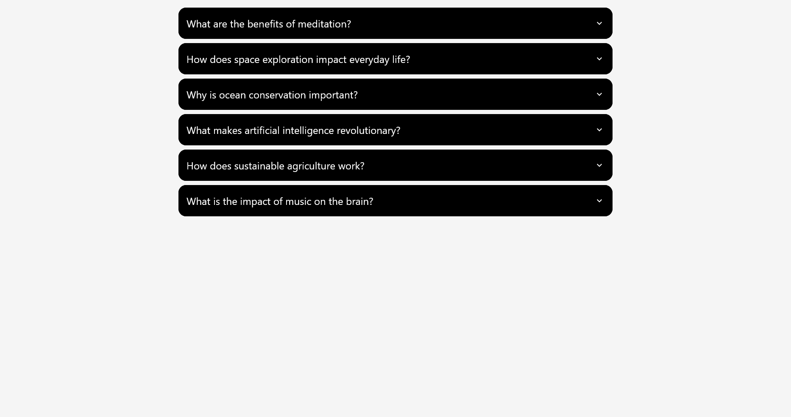
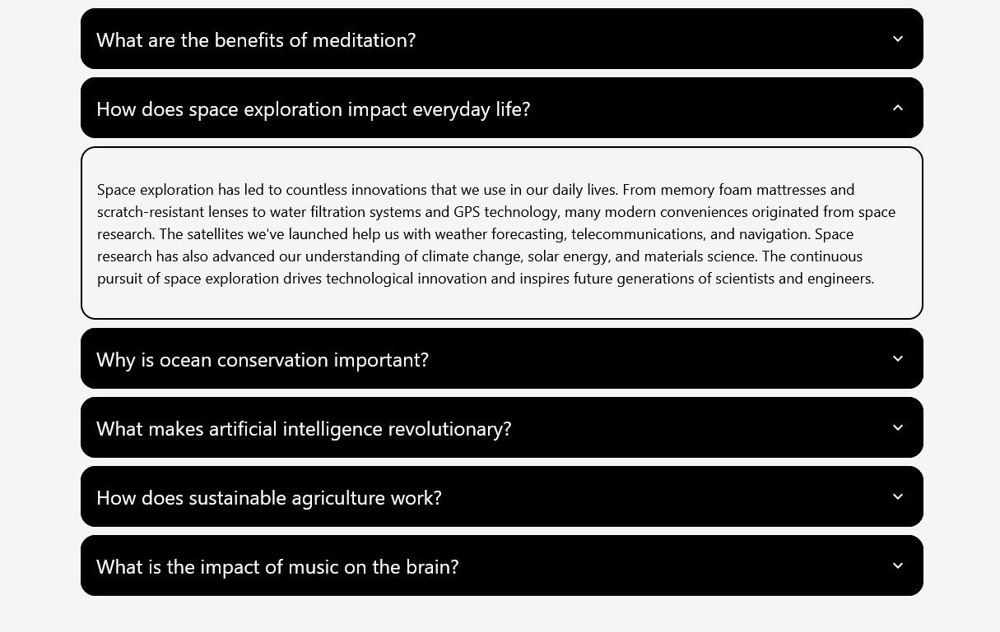
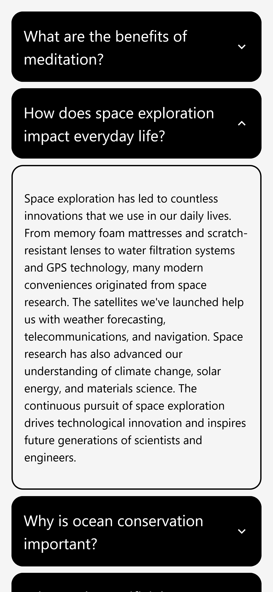

# React Accordion
A simple accordion component built with React and TypeScript.

## Introduction
This project was created to test my skills in building a simple React component with TypeScript.

I learned a bit of React back in 2021, but hadn't worked with it since. I decided to get back into frontend development, so I've been working on catching up lately.

I started learning TypeScript the same day I created this project (03/28/2025). I wanted to see if I could build a functional component using my (so far) limited knowledge.

## Features
- A simple accordion that renders items based on a given dataset:
  ```ts
  interface AccordionItemData {
    id: number;
    title: string;
    content: string;
  }
  ```
- The expand/collapse button changes depnding on the state of its item.
- Only one item can be expanded at a time. Parent `Accordion` component remembers which item is currently open.

## State Management
This component uses React's built-in `useState` hook to manage its state. The state is used to keep track of which item is currently expanded and only allow one (or none) to be expanded at a time.

## Design and Styling
The component uses a simple and responsive design with black/white colors (`#f5f5f5` used as background to be easier on the eyes).

The title and expand/collapse button are separated using flexbox.

## Future Development
I'm fairly confident there's many react accordion components out there with undoubtedly a myriad more features, so I'm not really interested in getting this to production ever.

I might add animations, more advanced styling, or play with different ways of getting the data for the items; but, for now, this satisfies me as a VERY early first project.

## Screenshots
Here are some screenshots of the accordion in action:




